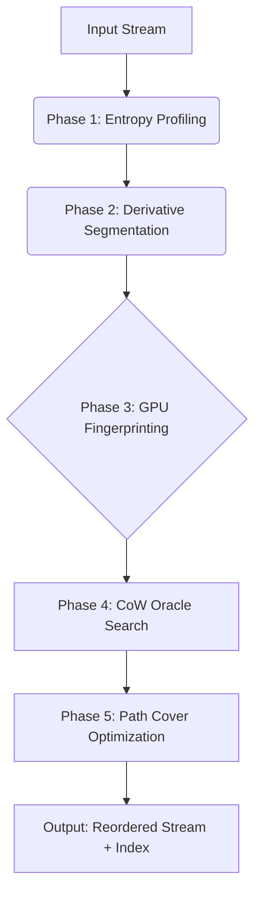

# CCR: Contextual Continuity Reordering

[](https://www.gnu.org/licenses/gpl-3.0)
[]()
[]()

**Entropy-Aware Segment Reordering for Context-Mixing Compression**

CCR is a deterministic preprocessing framework designed to mitigate "regime shock" in high-order context-mixing (CM) compressors like `fx2-cmix`. By decoupling the storage order of a file from its semantic order, CCR creates a "low-entropy path" through data, linking structurally compatible segments to maximize context reuse and prediction accuracy.

> **Note:** This repository implements the CCR driver and the "Oracle Mode" modifications for `fx2-cmix`.

---

## 🚀 Key Features

* **Entropy-Derivative Segmentation:** Uses a gradient-based change-point detection algorithm to slice files at natural statistical faults, rather than arbitrary rolling hash boundaries.
* **"Lobotomized" Oracle:** Runs a modified, lightweight version of `fx2-cmix` (disabling LSTM/Transformer layers) to perform blazing-fast entropy profiling ($>200$ MB/s).
* **Copy-on-Write (CoW) Search:** Leverages sparse state overlays to evaluate thousands of candidate transitions without full re-compression.
* **GPU-Accelerated Fingerprinting:** Uses **Hellinger Distance** on Markov Transition Matrices (calculated via CUDA) to filter candidates based on structural regime (e.g., XML vs. Binary) rather than vocabulary.
* **Asymmetric Reconstruction:** Decompression is $O(N)$ and requires no Oracle consultation.

---

## 🛠️ Architecture

CCR operates as a pipeline wrapping the target compressor. It treats input ordering as a degree of freedom to be optimized.



### The Oracle Strategy

Instead of shipping a separate binary (like MCM), CCR patches `fx2-cmix` with a `--oracle` flag. This mode disables the heavy neural components (LSTM, Attention) while keeping the structural sensors (LZP, Order-0, Sparse Contexts) active. This ensures the Oracle's predictions align perfectly with the target's dictionary and parsing logic while running orders of magnitude faster.

---

## 📦 Installation

### Prerequisites

* **C++17** compliant compiler (GCC 9+ or Clang 10+)
* **CUDA Toolkit 11+** (for Phase 3 acceleration)
* **Python 3.8+** (for the coordination script)
* **CMake 3.15+**

### Build Steps

1. **Clone the Repository** (Recursive to pull the `fx2-cmix` submodule)
```bash
git clone --recursive [https://github.com/](https://github.com/)[your-username]/ccr-compression.git
cd ccr-compression

```


2. **Patch & Build fx2-cmix**
```bash
# Applies the "Lobotomy Mode" patch to the submodule
./scripts/patch_fx2.sh 

cd fx2-cmix && mkdir build && cd build
cmake -DCMAKE_BUILD_TYPE=Release ..
make -j$(nproc)

```


3. **Build CCR Tools**
```bash
cd ../../ccr-core
mkdir build && cd build
cmake ..
make -j$(nproc)

```


---

## 💻 Usage

### Basic Compression

To reorder and compress `enwik8`:

```bash
# Step 1: Analyze and Reorder
# Generates enwik8.ccr (payload), enwik8.idx (index), and enwik8.seg (table)
python3 ccr.py reorder --input enwik8 --oracle ./fx2-cmix/fx2 --gpu 0

# Step 2: Final Compression
# Compresses the reordered payload using the full-fat fx2-cmix
./fx2-cmix/fx2 -c enwik8.ccr enwik8.ccr.fx

```

### Decompression / Reconstruction

Reconstruction requires the compressed payload and the metadata files.

```bash
# Step 1: Decompress Payload
./fx2-cmix/fx2 -d enwik8.ccr.fx enwik8.ccr

# Step 2: Reconstruct Original Order
# Uses the RLE-Move Index and Segment Table to restore the file
python3 ccr.py reconstruct --payload enwik8.ccr --index enwik8.idx --table enwik8.seg --output enwik8.restored

```

### Advanced Configuration

You can tune the segmentation sensitivity and candidate search window in `config.yaml`:

```yaml
segmentation:
  entropy_threshold: 0.05    # Gradient trigger for cuts
  min_segment_size: 4096     # 4KB refractory period
  atomic_fusion_tol: 1.05    # Fusion tolerance (1.05x C_stock)

search:
  beam_width: 32             # Candidates per segment
  head_check_size: 10240     # 10KB Head-Check window
  gpu_device: 0

```

---

## 📊 Performance (Expected)

| Metric | Baseline (fx2-cmix) | CCR + fx2-cmix |
| --- | --- | --- |
| **Compression Ratio** | *Baseline* | **-0.X% bpb** (Target) |
| **Memory (Compress)** | 16 GB | 16 GB + 2 GB (CoW) |
| **Time (Compress)** | ~10 hours | ~10.5 hours |
| **Time (Decompress)** | ~10 hours | ~10 hours + **<5s** |

*Note: CCR adds negligible overhead to the total compression time, as the Oracle phase runs on the CPU grid/GPU in parallel with the main compression job.*

---

## 🧠 Technical Details

* **First-Order Assumption:** We approximate the value of a chain  as . This is conservative; it ignores long-range priming but prevents regression via the  check.
* **Hellinger Distance:** Phase 3 uses Hellinger distance rather than Euclidean to robustly compare the 8-class Markov transition matrices, as it is mathematically superior for probability distributions.
* **Atomic Fusion:** Naturally coherent structures (like large XML tables) are fused into "Super-Segments" to prevent fragmentation, ensuring CCR degrades gracefully to an identity transform on homogeneous files.

---

## 📄 Citation

If you use CCR in your research or benchmarks, please cite:

```bibtex
@article{ccr2024,
  title={Contextual Continuity Reordering: Entropy-Aware Segment Reordering for Context-Mixing Compression},
  author={[Your Name]},
  journal={arXiv preprint},
  year={2024}
}

```

## 📜 License

This project is licensed under the **GNU General Public License v3.0** - see the [LICENSE](https://www.google.com/search?q=LICENSE) file for details.
*Derived from `fx2-cmix` and `PAQ` family compressors.*

```
